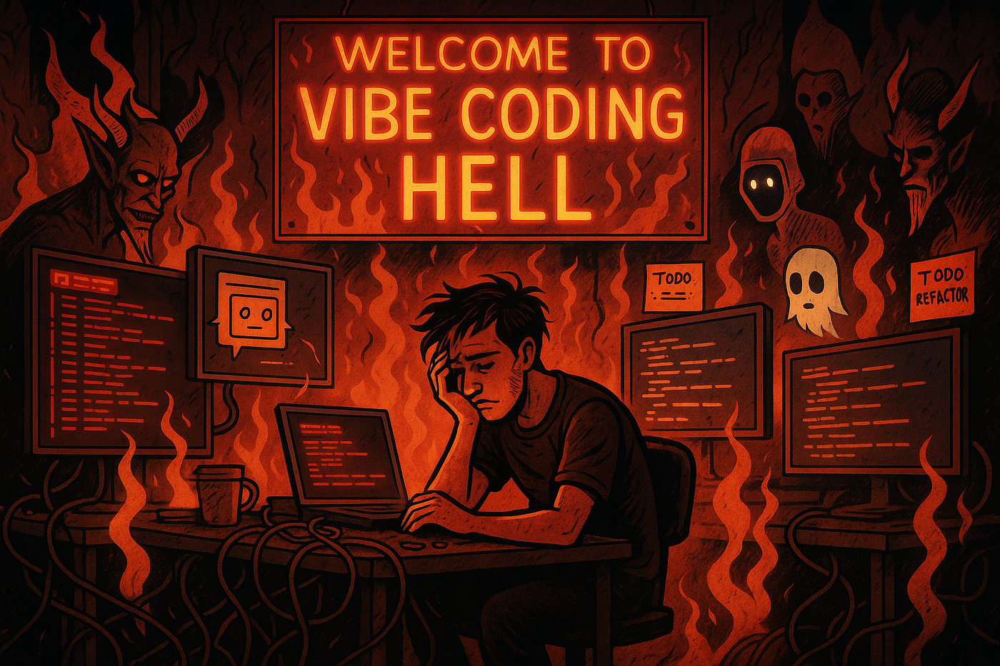
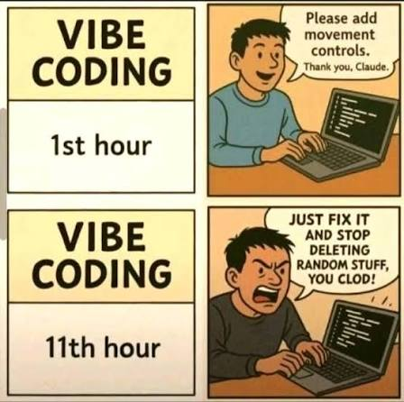
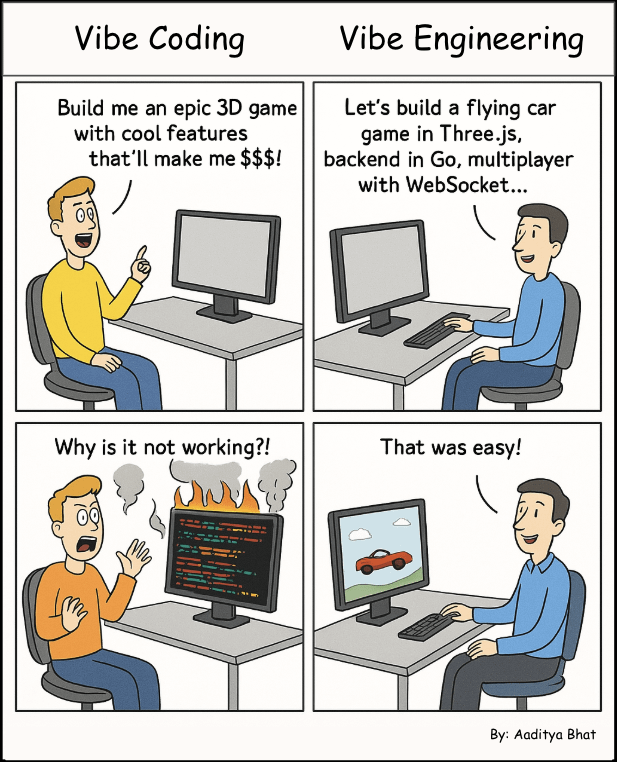
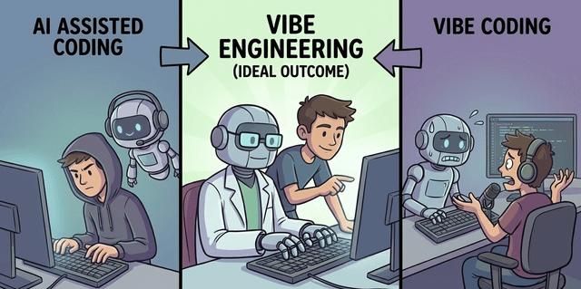
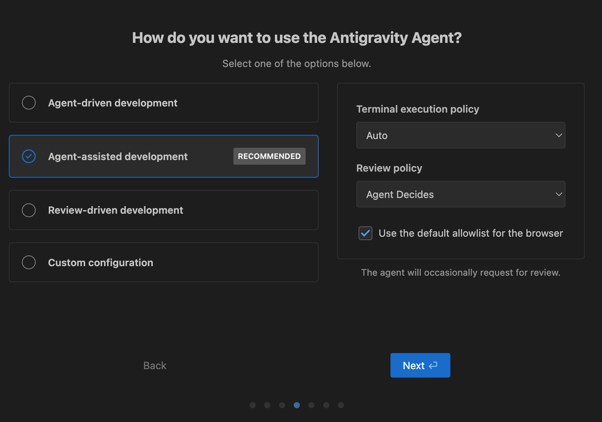
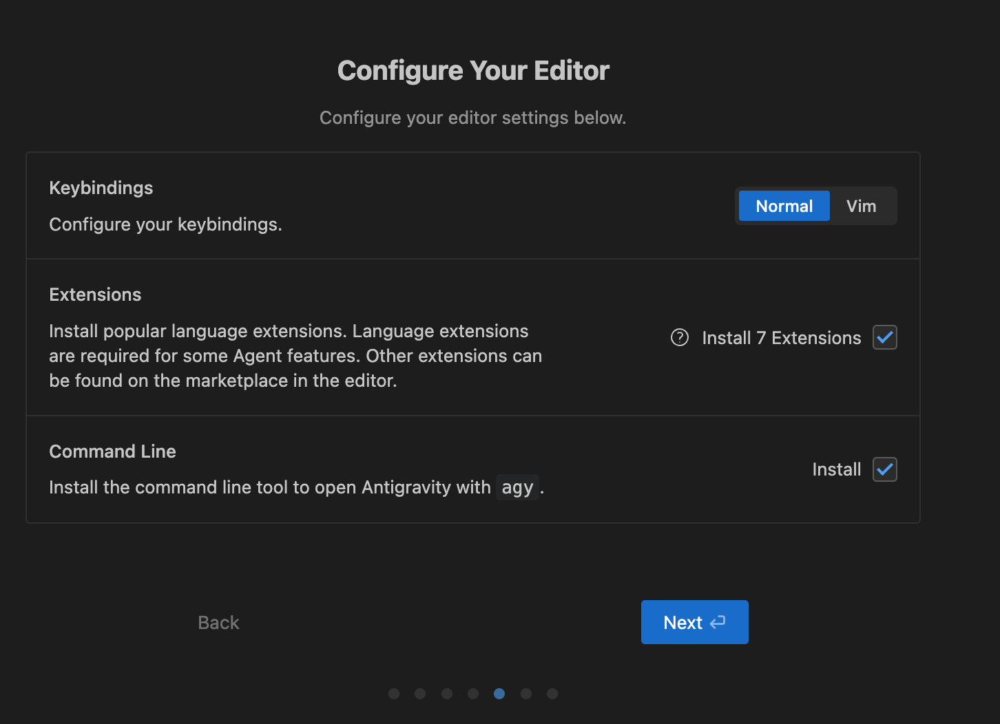
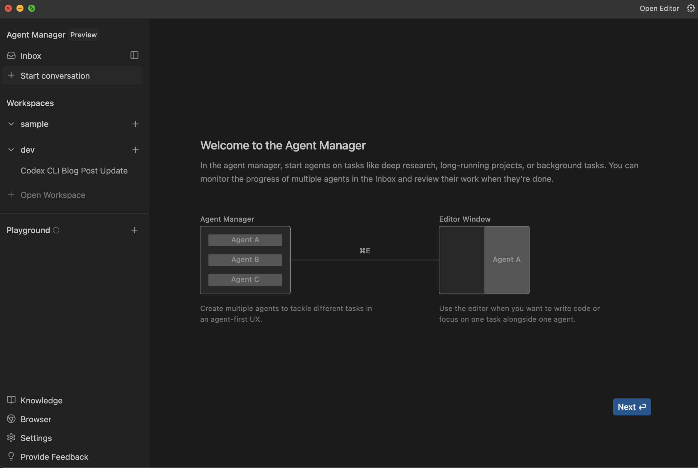

# Vibe Engineering with Antigravity

## Vibe Coding

개발자가 대규모 언어 모델(LLM)에 프로젝트나 작업을 설명하면 LLM이 프롬프트에 따라 소스 코드를 생성하는 방식

"분위기에 완전히 몰입하고, 기하급수적 증가를 수용하고, 코드가 존재한다는 사실조차 잊어버리는 것"

 - Andrej Karpathy - 

---

## Vibe Coding Paradise

---

## Vibe Coding Hell

---

## Vibe Coding 은 왜 실패 하는가?
### 시간 손실
처음에는 속도가 빠른 것처럼 보이지만 (빠른 PoC 확보), 개발이 구체화 될 수록 오류나 변경에 쉽게 영향을 받음

### 재작업 증가
- 초기에 빠르게 작성한 코드가 나중에 목적에 맞지 않아 전체를 다시 수정해야 하는 경우가 생김
- 생성되는 코드가 항상 동일 하지 않은 경우 발생

### 비용 상승
AI의 컨텍스트 윈도우가 커질수록 API 호출 비용이 함께 증가 (예: 수십만 토큰을 전송하고 수천 줄의 코드를 생성하면 비용 부담이 커짐)

요구사양 분석, 설계 부재
 개발 비용 절감을 위한 설계 부재 (SOLID)

---

## Vibe Engineering
'Vibe Coding은 AI를 이용해 빠르고, 허술하고, 무책임하게 소프트웨어를 개발하는 방식’
- Simon Willison -

### 사전 계획
- 요구사양 분석  반복/변경의 최소화
- 구조 설계 (SOLID)  Idempotency, Low Cost

### 포괄적 문서화
- 요구사항/구조 Context화  Consistency, Idempotency 확보

### 버전 관리
- 실수를 빠르게 복원  반복/변경의 영향 최소화

### 자동화된 테스트+수동 QA
https://simonwillison.net/2025/Oct/7/vibe-engineering/

---

## Google Antigravity
### AI 에이전트 중심 (Agent-First)
AI Agent가 제안, 문서/코드 작성, 실행, 테스트(Chrome Agent 이용한 테스트 지원), 검증 작업을 스스로 수행
Plan Mode 지원 : 복잡한 작업 수행 시, 작업 분석, 계획을 먼저 수립하고 사용자가 승인하면 작업을 진행

### 두 가지 주요 인터페이스
- **Editor view**: 일반 IDE 처럼 코드 편집과 실시간 작업을 수행
- **Manager view**: 여러 AI 에이전트를 관리하고 동시에 여러 작업을 병렬 수행할 수 있는 중앙 허브 역할

### Artifacts 체계
작업 결과물(계획, 스크린샷, 브라우저 녹화 등)을 생성해서 사용자에게 검증 가능한 형태로 제공.

### 다양한 AI 모델 지원
구글 Gemini 계열(Pro/Flash) / Anthropic Claude(Sonnet/Opus) / GPT-OSS 지원
https://youtu.be/nTOVIGsqCuY

AI 기반 통합 개발 환경. AI 에이전트가 주도적으로 개발 작업을 수행하도록 설계된 플랫폼 (현재는 공개 미리보기로 배포)
Browser 직접 제어를 통한 테스트

---

## Vibe Engineering with Antigravity
### Requirements 분석
요구사양, 제약사항을 지정. 상세히 기록 할 수록 정확한 결과를 얻는다. 입출력 스키마 등 샘플을 Few-Shot으로 제공하면 효과적 이다. Multi-Modal을 지원 하므로 Mockup 이미지를 활용하는 것도 효과적이다.

### 주요 기술 Stack 선정
SW 에서 사용할 주요 개발 Framework, Library, DB 등을 지정 생소한 기술 이라도, Agent와 대화로 내용과 장단점 비교가 가능하니 적극 활용 할 것

### 프로젝트 구조 설계
가급적 SOLID 한 구조를 가지도록 지침을 설정 한다. Agent가 참조할 부분이 커지지 않도록 한다.  변경 범위를 최소화하여 작업결과의 일관성 유지 + Context를 줄임으로서 Token 비용을 절감

### Coding Rule 설정
코드 품질 개선 및 Token 비용 절감을 위한 지침 설정

### B/M 대상이 있는 경우
해당 시스템의 정보를 이용하여 Agent가 정리 하도록 할 수 있다. (단, 생성 결과에 대한 리뷰할 것을 권장 함)

아래 내용들은 Markdown 형식으로, Project Workspace의 Root의 /docs 에 생성 한다
토큰 사용량 37.91%를 감소시킨 단 한줄의 프롬프트

AI가 모든 문제를 완벽히 해결 해주지 않는다. 오히려 망쳐버릴 수도 있다. AI로도 해결하기 어렵고 복잡한 상황은 언제든지 발생 할 수 있다. AI는 LLM의 특성상, 항상 같은 코드를 생성하지 않을 수도 있으며, 인지 하지 못한 사이에 잘 동작 하던 코드를 망가뜨릴 수 있다.

**모든게 끝이다 싶을때, Git 은 유일한 구원의 길이다! 수시로 Commit 하는 습관을 들이자!**
 가급적 최대한 자주 Commit 하는 습관을 가져야 한다.

다행히 Agent 는 Git 을 아주 잘 다룰 수 있다. Commit 만 잘 되어 있다면 수정 이력을 조회하고 문제의 해결 방안을 찾아낼 수 있다.

### Model의 사용량(Quota)
제공되는 모델의 Quota 가 얼마인지 공식 적으로 공개 되지 않았으나 Daily Quota 와 Weekly Quota가 설정 되어 있다. Daily Quota 는 한계 도달 시 5간 정도, Weekly Quota 는 한계 도달 시 3~5일 정도의 Cool Time 후, 충전된다!!!

생성되는 코드와 설명은 모두 돈이다! 그리고 버그 또한 돈이다!
 작업 요청 입력 시 Mode 와 Model 설정을 반드시 고민하고 변경 할 것!

Plan Mode 는 정교하고 복잡한 작업을 잘 해결 해주지만 많은 양의 Token을 소모하므로 단순 작업이나 질의시에는 Fast Mode로 전환 하는 것이 좋다.

### Model 별 Token 소모량
Gemini Pro(High) > Gemini Pro(Low) > Gemini Flash
Claude Opus 4.5 (Thinking) > Claude Sonnet 4.5 (Thinking) > Claude Sonnet 4.5

### 다중 계정 활용!
Google에서 5개 까지 개인 계정을 생성 할 수 있으며, Google One AI Pro 구독은 가족 계정을 5개 등록 가능하다!  동료 계정에 가족계정을 등록을 통하여 다중 계정을 등록하면 모델 한계치 초과문제 해결이 가능하다.

---

## Antigravity Configuration
### 1. 개발 모드 선택 (Development Modes)
Agent 개입 수준을 선택

1. **Agent-driven development**: 기획부터 구현까지 AI가 적극적으로 수행하며, 사용자는 감독자 역할.
2. **Agent-assisted development [선택됨/권장]**: 사용자가 주도권을 쥐고, Agent는 Copilot 역할을 수행. (일부 작업 사용자 승인 필요) 가장 균형 잡힌 모드. 개발자가 방향을 잡으면 Agent 가 작업을 수행.
3. **Review-driven development**: Agent 의 모든 행동에 대해 사용자가 승인. 안전성은 높지만, 작업 속도가 느리다.
4. **Custom configuration**: 각 권한을 세부적으로 직접 설정.

### 2. 세부 실행 정책 (Execution Policies)
선택한 모드에 따른 행동 규칙

1. **Terminal execution policy: Auto**: 터미널 명령어(패키지 설치, 파일 실행 등)를 Agent가 자동(Auto)으로 실행 허용. 개발 속도가 매우 빨라집니다. 매번 "이 명령어를 실행해도 될까요?"라고 묻지 않습니다.
   *주의: rm -rf와 같은 위험한 명령어가 실행될 가능성이 미세하게나마 있으므로, 신뢰할 수 있는 환경에서 사용하는 것이 좋습니다.*
2. **Review policy: Agent Decides**: 언제 사용자에게 검토(Review)를 요청할지를 Agent가 스스로 판단합니다. 단순한 작업은 알아서 처리하고, 중요한 변경 사항이나 불확실한 부분에서만 요청하게 됩니다.
3. **Browser Allowlist Checkbox**: Agent가 웹 브라우저를 통해 정보를 검색하거나 접근할 때, 기본적으로 허용된 목록(Allowlist) 내에서만 작동하게 하여 보안을 유지합니다.

### 1. Keybindings (단축키 설정)
- **Normal [선택됨/권장]**: 일반적인 최신 에디터(VS Code, 메모장 등)와 동일한 단축키 방식을 사용합니다.
- **Vim**: 리눅스/유닉스 환경의 Vim 에디터에 익숙한 개발자를 위한 모드입니다.

### 2. Extensions (확장 프로그램 설치)
- Agent를 위해 필요한 기본 도구들을 설치합니다.
- **Install 7 Extensions [체크됨/필수]**: 주요 언어에 대한 Syntax Highlighting, 자동 완성, Linting 등을 지원하는 확장팩을 설치합니다.
- **중요성**: 이 옵션은 반드시 체크해야 합니다. "Language extensions are required for some Agent features" 이 확장팩이 설치되어야 Agent가 코드 문맥을 정확히 파악하고 오류를 잡아낼 수 있습니다.

### 3. Command Line (터미널 도구 설치)
- Terminal 에서 바로 에디터를 실행할 수 있는 명령어를 설치합니다.
- **Install (agy) [체크됨/권장]**: Terminal 에서 `agy .` 을 입력하면, 해당 폴더를 프로젝트 루트로 하여 Antigravity 에디터가 바로 열립니다.

---

## Antigravity : Agent Manager
### 사이드바 구성
- **Inbox**: 모든 Agent 작업 알림. 진행 상황 모니터링 및 완료된 작업 리뷰
- **+ Start conversation**: 새로운 Agent 대화 시작
- **Workspaces**: 등록한 프로젝트 폴더들. 각 워크스페이스 옆 + 버튼으로 Agent 추가
- **+ Open Workspace**: 새 워크스페이스(폴더) 등록
- **Playground**: 폴더 없이 빠른 프로토타이핑 테스트
- **Knowledge**: Agent 학습 데이터 관리
- **Browser**: 브라우저 연동 설정
- **Settings**: 환경 설정

리서치, 장기 프로젝트, 백그라운드 작업 같은 Task 를 Agent에게 위임하고 관리 수단을 제공 한다.

### Knowledge 기반 학습
- **자동 수집**: 작업 중 생성된 코드 스니펫, 태스크 리스트가 자동 저장
- **스타일 학습**: 시간이 지나면서 팀의 코딩 컨벤션과 패턴을 학습
- **컨텍스트 활용**: 새 작업 시 이전 학습 내용을 참고하여 더 정확한 코드 생성
- **수동 관리**: 불필요한 학습 데이터 삭제, 중요 패턴 우선순위 조정 가능
- → Cursor의 .cursorrules와 달리 명시적 규칙 작성 없이도 자동으로 팀 스타일에 맞춰진다.

---

## Agent Settings
### ARTIFACT 설정
- **Review Policy**: Agent 가 생성한 아티팩트(계획, 코드 등)를 리뷰할지 결정
  - Always Proceed: 리뷰 없이 항상 진행 (빠른 작업용)
  - Agent Decides: Agent 가 상황에 따라 리뷰 요청 여부 판단 [권장]
  - Request Review: 항상 리뷰 요청 (신중한 작업용)

### TERMINAL 설정
- **Terminal Command Auto Execution**: 터미널 명령어 자동 실행 정책
  - Off: 자동 실행 안 함 (Allow List 제외). 가장 안전
  - Auto: Agent 가 명령어별로 실행 여부 판단 [권장]
  - Turbo: 항상 자동 실행 (Deny List 제외). 가장 빠름, 주의 필요
- **Allow/Deny List Terminal Commands**
  - Allow List: Off 모드에서도 자동 실행을 허용할 명령어 등록
  - Deny List: Turbo 모드에서도 확인을 요구할 위험 명령어 등록 (예: rm -rf)

### FILE ACCESS 설정
- **Agent Gitignore Access**: .gitignore에 있는 파일 접근 허용 (민감 파일 주의)
- **Agent Non-Workspace File Access**: 워크스페이스 외부 파일 접근 허용 (보안상 OFF 권장)
- **Auto-Open Edited Files**: Agent 가 수정한 파일 자동으로 열기 [ON 권장]

### AUTOMATION 설정
- **Agent Auto-Fix Lints**: Agent가 생성한 코드의 린트 에러를 자동 수정 [ON 권장]
- **Auto-Continue**: 응답 한도 도달 시 자동으로 계속 진행 (OFF면 수동 확인 필요)

### GENERAL 설정
- **Enable Agent Web Tools**: 웹 검색 및 URL 읽기 기능 활성화 [ON 권장]
- **Open Agent on Reload**: 창 새로고침 시 에이전트 패널 자동 열기

### ADVANCED 설정
- **Enable Demo Mode (Beta)**: 데모용 UI 모드 활성화. 일관된 데모 화면을 위해 UI가 약간 수정된다.

---

## Section 17: Antigravity 실습
1. Git 설정
2. Antigravity 설치
3. Vibe Coding 실습 : Tic-Tac-Toe 게임 만들기
4. Vibe Engineering 실습 : 숫자 야구게임 만들기

## Section 18: Antigravity 실습
### 3. Tic-Tac-Toe 게임 만들기
1. 새 Workspace 용 폴더 생성
2. Antigravity 실행  폴더 열기(File > Open Foler)
3. Tic-Tac-Toe 게임 생성 지시
   - Planning Mode + Claude Sonnet 4.5 (Thinking)
   - 구현 계획 리뷰  Fast Mode  Claude Sonnet 4.5  승인
4. 생성 결과 확인
5. Git Commit  Push  PR

## Section 19: Antigravity 실습
### 4. 숫자 야구게임 만들기
1. 새 Workspace 용 폴더 생성
2. Antigravity 실행  폴더 열기(File > Open Foler)
3. 야구 게임 개발 요구사양 분석
   - 참조 : https://namu.wiki/w/%EC%88%AB%EC%9E%90%EC%95%BC%EA%B5%AC
   - Fast Mode + Gemini 3 Pro (Low)
   - Requirement 생성 및 기록 지시
4. 기술 스택 작성 지시
5. 개발 시작 및 계획서 승인
   - Plan Mode + Claud Sonnet 4.5 (Thinking)

6. 계획서 승인 밑 작업 시작
   - Fast Mode + Claud Sonnet 4.5
7. 작업 결과 확인
8. Git Commit  Push  PR
9. 추가 작업 : 게임 내용 저장 및 복기 기능 추가
   - 3~6) 반복: 요구사양 추가/업데이트  이력저장 DB 기술 스택 결정/업데이트  계획 수립  작업 진행

